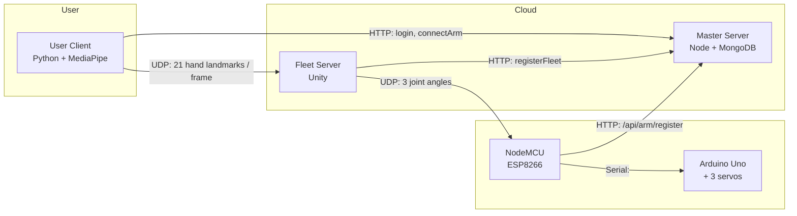

# Telehand

Control a physical robotic hand over the internet with nothing but a webcam.

Formerly **SHTRM** (Server Hand Tracking Robotic Hand); the original sub-repos
linked below still use that naming.

A user's hand is tracked with MediaPipe, the 21 landmarks are streamed over UDP
to a Unity "fleet server" that reconstructs the hand in 3D and computes finger
joint angles, and those angles are forwarded to an ESP8266 + Arduino Uno that
drives the servos on a 3D-printed hand. A Node.js "master server" handles
accounts, robot registration, and matching users to the fleet server their robot
is connected to.

This was a high school science fair project built during the 2021–2022 school
year and presented at the **2022 Regeneron International Science and Engineering
Fair (ISEF)**. This repository is the monorepo archive of the four codebases
that made up the system.

> **Status:** archived as-built. The code is preserved exactly as it was when
> the project was presented; it has not been refactored or updated since.

## Repository layout

| Directory | Original repo | Stack | Role |
|---|---|---|---|
| [`user-client/`](user-client/) | [PythonHandController](https://github.com/jaximus808/PythonHandController) | Python, OpenCV, MediaPipe, Tkinter | Desktop app: log in, pick a robot, stream webcam hand tracking |
| [`master-server/`](master-server/) | [MasterRoboticHandServer](https://github.com/jaximus808/MasterRoboticHandServer) | Node.js, Express, MongoDB, JWT | Accounts, robot registry, fleet-server registry, matchmaking |
| [`fleet-server/`](fleet-server/) | [HandRobotFleeetServer20212022](https://github.com/jaximus808/HandRobotFleeetServer20212022) | Unity 2020.3 (C#) | UDP relay: renders the hand in 3D, computes joint angles, drives the robot |
| [`robotic-client/`](robotic-client/) | [HandArduinoController](https://github.com/jaximus808/HandArduinoController) | Arduino (ESP8266 NodeMCU + Uno) | Registers the robot, receives joint angles, moves the servos |

The original repositories are kept as the record of the full commit history
(September 2021 – April 2022). This monorepo is a snapshot of each repo's final
state with build artifacts (Unity `Library/`, `node_modules/`, `__pycache__/`,
IDE files) removed.

## How it works

### Lifecycle

1. **Fleet server boots** (Unity) and registers itself with the master server
   over HTTP. The master records its IP and UDP port in `fleetServers.json`.
2. **Robot boots.** The NodeMCU joins Wi-Fi and POSTs its robot ID and password
   to the master server. The master picks the least-loaded fleet server and
   returns its IP and port. The NodeMCU then sends a UDP handshake to that fleet
   server, which verifies the robot with the master and marks it `connected`.
3. **User logs in** through the Tkinter app. The master returns a JWT which the
   client stores locally. The user enters a robot ID and password; the master
   replies with the IP and port of the fleet server that robot is on.
4. **Streaming.** The client opens the webcam, runs MediaPipe Hands, and sends
   every frame's landmarks over UDP to the fleet server. The fleet server places
   21 spheres per hand in a Unity scene, computes the bend angle of each finger
   at the knuckle using the law of cosines on the wrist / MCP / PIP landmarks,
   and sends the index, middle, and ring angles to the robot.
5. **Actuation.** The NodeMCU forwards the three angles to the Uno over serial.
   The Uno clamps and scales them and writes to three servos.
6. **Keep-alive.** The fleet server pings every user and robot on a timer.
   Anything that does not answer is dropped, and the master is told to mark the
   robot disconnected.

### Wire protocol

All UDP packets are little-endian binary. Strings are a 4-byte length followed
by ASCII bytes. Packet framing lives in
[`fleet-server/Assets/Scripts/Packet.cs`](fleet-server/Assets/Scripts/Packet.cs)
and is mirrored in the Python and Arduino clients.

**User client → fleet server**

| Purpose | Layout |
|---|---|
| Join | `int 0`, `int -1`, `int robotId` |
| Hand data | `int 1`, `int clientId`, `int 1`, `bool hasHands`, `int handCount`, `bool isRight`, then `21 × (float x, float y, float z)` per hand |
| Ping reply | `int 1`, `int clientId`, `int 3`, `bool false` |

**Fleet server → user client**

| Purpose | Layout |
|---|---|
| Assigned ID | `int 0`, `int clientId` |
| Ping | `int 1` |
| Server closing | `int 10` |

**Robot → fleet server** (every packet starts with `int -1` and the node
password so the fleet server can tell robots from users)

| Purpose | Layout |
|---|---|
| Register | `int -1`, `string nodePass`, `int 0`, `int robotId`, `string armPass`, `string nodePass` |
| Ping reply | `int -1`, `string nodePass`, `int 1`, `int robotId` |

**Fleet server → robot**

| Purpose | Layout |
|---|---|
| Registered | `int 0`, `int 1` |
| Ping | `int 1` |
| Joint angles | `int 2`, `int index`, `int middle`, `int ring` |
| Server closing | `int 10` |

**NodeMCU → Uno** is plain text over serial at 115200 baud: `<j1,j2,j3,>`.

### Master server HTTP API

All routes are `POST` with form-encoded or JSON bodies and return
`{ error: bool, message: string, ... }`.

| Route | Auth | Used by |
|---|---|---|
| `/api/user/createUser` | – | User client: register, returns JWT |
| `/api/user/loginUser` | – | User client: login, returns JWT |
| `/api/user/accountDetails` | JWT | User client: validate stored token |
| `/api/user/connectArm` | JWT | User client: get fleet IP/port for a robot |
| `/api/arm/register` | arm password | NodeMCU: register robot, get fleet IP/port |
| `/api/loginArm` | – | Robot login by ID and password |
| `/server/auth/registerFleet` | fleet password | Fleet server: announce itself |
| `/server/auth/connectedArmClient` | fleet + arm password | Fleet server: mark a robot online |
| `/server/auth/disconnectArmClient` | fleet + arm password | Fleet server: mark a robot offline |
| `/server/auth/disconnectFleet` | fleet password | Fleet server: going down, mark robots offline |

## Running it

Each component has its own README with setup steps:

- [`master-server/README.md`](master-server/README.md) — `npm install`, fill in `.env`, `npm run dev`
- [`fleet-server/README.md`](fleet-server/README.md) — open in Unity 2020.3.32f1, set the master IP, press Play
- [`robotic-client/README.md`](robotic-client/README.md) — flash `nodemcu.ino` and `uno.ino`, wire the servos
- [`user-client/README.md`](user-client/README.md) — `pip install` the deps, run `WindowRenderer.py`

Bring them up in that order: master server, fleet server, robot, then the user
client.

## Notes on the code

This is student code written under a science fair deadline, and it is kept
here unchanged. A few things to know before running it:

- Server addresses, Wi-Fi credentials, and shared passwords are hardcoded in
  `robotic-client/nodemcu/nodemcu.ino`, `user-client/HandController/WindowRenderer.py`,
  and `fleet-server/Assets/Scripts/UDPServer.cs`. Change them for your network.
- Only three fingers (index, middle, ring) are actuated. The pinky angle is
  computed but never sent, and the thumb is not modelled.
- The user client's UDP receive path uses `WindowsError`, so it is Windows-only
  as written.
- Fleet-server selection in the master server is a simple "fewest connected"
  scan over `fleetServers.json`.

## Author

Jaxon Poentis ([@jaximus808](https://github.com/jaximus808))
